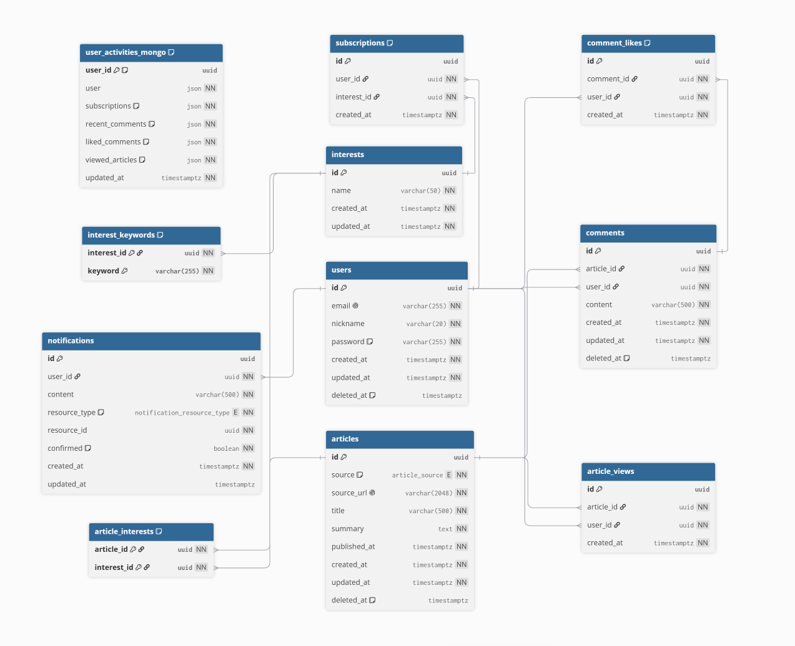

# sb13-Monew-team03

[팀 협업 문서 링크]
https://app.notion.com/p/Home-3b90d0523b9b809e9b74d858b5e71860

[Monew Codecov]

---

## 프로젝트 링크

- Swagger: [링크]
- 배포 주소: [링크]
- 발표 자료: [링크]

---

## 팀원 구성

| 이름 | 담당 |
| --- |  |
| 박민재 | 관심사·구독 / 팀장 |
| 백한천 | 알림·활동내역 |
| 오재건 | 댓글·좋아요 |
| 유하정 | 기사 수집·삭제 / 배포 |
| 장현서 | 사용자·인증 |
| 조혜령 | 기사 조회·백업/복구 |

---

## 프로젝트 소개

- 여러 뉴스 API를 통합하여 사용자에게 맞춤형 뉴스를 제공하고, 의견을 나눌 수 있는 소셜 기능을 갖춘 서비스
- 프로젝트 기간: 2026.08.11 ~ 2026.09.XX

---

## 기술 스택

- Backend: Java 17, Spring Boot, Spring Data JPA, QueryDSL, Spring Batch
- Database: PostgreSQL, MongoDB
- Infra: AWS ECS, ECR, S3, Docker
- Tool: GitHub, Notion, Discord

---

## 팀원별 구현 기능

### 박민재
- 관심사 및 구독 CRUD 구현
- Levenshtein Distance 기반 관심사 이름 유사도 검증
- QueryDSL 기반 검색·정렬 및 Cursor Pagination 구현
- 중복 구독 예외 처리 및 연관 데이터 삭제 처리
- 공통 예외 처리 및 MDC 기반 로그 관리
- 관심사 API 테스트 및 Swagger 문서 작성
- GitHub Actions 기반 CI 파이프라인 구축
- 팀 노션 관리 및 시연 영상 제작

### 백한천
- 알림 목록 커서 페이지네이션 조회 및 개별·전체 확인 기능 구현
- 기사 등록 등 도메인 이벤트 기반 알림 생성 및 트랜잭션 커밋 후 처리
- 오래된 확인 알림 자동 삭제 스케줄러 구현
- MongoDB 기반 사용자 활동 내역 조회 및 저장 모델 구현
- 댓글 작성·수정·삭제, 좋아요, 기사 조회 등 사용자 활동 이벤트 연동
- 동시성에 안전한 활동 내역 프로젝션 처리 및 삭제 사용자 활동 재생성 방지
- 알림·사용자 활동 내역 예외 처리 및 Swagger 문서화
- 알림·사용자 활동 내역 관련 컨트롤러, 서비스, 레포지토리 테스트 작성 및 보완

### 오재건
- 댓글, 좋아요 CRUD 구현
- swagger 문서 및 API 명세 작성
- 댓글, 좋아요 기능관련 테스트 작성

### 유하정
- Naver News API 및 RSS 기반 뉴스 기사 수집 기능 구현
- 관심사 키워드 기반 기사 수집 및 중복 기사 검증·저장 기능 구현
- 뉴스 기사와 관심사 간 연관 관계(ArticleInterest) 저장 및 중복 방지 처리
- 신규 기사 등록 시 구독자 대상 알림 생성 기능 연동
- 뉴스 기사 논리 삭제 및 연관 데이터 정리를 포함한 물리 삭제 기능 구현
- Scheduler 기반 주기적 뉴스 기사 자동 수집 구현
- 기사 수집·저장·삭제 관련 테스트 작성 및 Swagger 문서화
- Docker·AWS ECR·ECS 기반 애플리케이션 배포 환경 구축 및 배포

### 장현서
- 회원가입, 로그인, 닉네임 수정 구현
- 사용자 논리 삭제 및 물리 삭제 구현
- 논리 삭제 사용자 로그인 차단
- 사용자 자동 물리 삭제 배치 및 연관 데이터 정리
- UserActivity 이벤트 연동
- Swagger 문서화 및 API 명세 수정
- User/Auth 관련 테스트 작성 및 보완

### 조혜령
- QueryDSL 기반 뉴스 기사 검색 및 커서 페이지네이션 구현
- 뉴스 기사 출처 목록 및 단건 조회 구현
- Spring Batch·Scheduler 기반 날짜별 기사 S3 백업 구현
- S3 백업 데이터와 DB 비교를 통한 유실 기사 복구 구현
- Swagger 문서화 및 API 명세 작성
- 기사 조회·백업·복구 과정의 커스텀 예외 처리 및 에러 응답 구현
- 기사 관련 단위·통합 테스트 작성 및 예외 케이스 검증

---
## ERD

